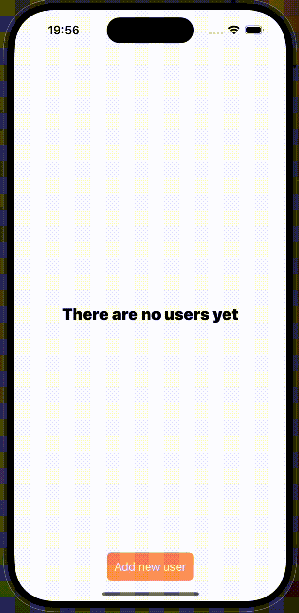

# RandomUserApp

RandomUserApp — это простое мобильное приложение, которое получает из API пользователей по запросу, сохраняет их, также дает возможность просмотреть подробную информацию о них, созданно с использованием UIKit, SwiftUI, MapKit. Проект реализован в рамках тестового задания на вакансию iOS разработчика.

## 🚀 Функциональность

- Добавить пользователя
- Удалить пользователя 
- Просмотерть подробную информацию  
- Загрузка данных из API

## 🧱 Технологии

- Swift  
- SwiftUI  
- UIKit  
- MVVM-архитектура  
- UserDefaults

## 🌐 Работа с API

В проекте используется **[Random User API](https://randomuser.me/)** для получения случайных данных пользователей.

## 📱 Интерфейс

Приложение содержит:
- Экран со список пользователей
- Экран подробной информации

## 📌 Статус проекта

Проект завершён. Используется как демонстрация навыков при отклике на вакансию.
